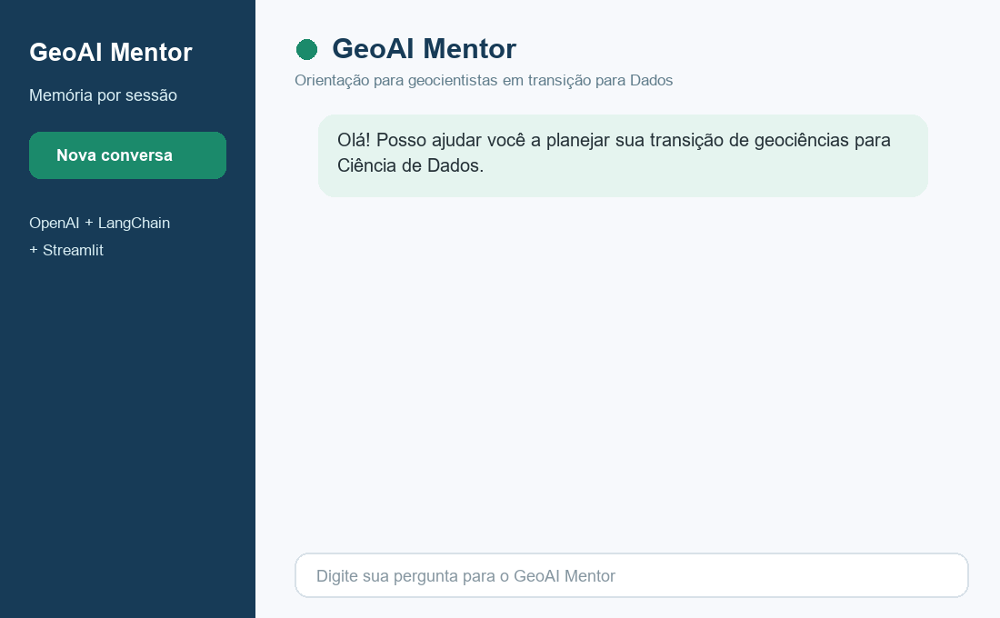
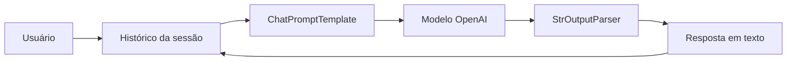

# GeoAI Mentor

Assistente de Inteligência Artificial criado para apoiar geocientistas que desejam migrar para Ciência de Dados. O projeto demonstra como transformar chamadas isoladas a um modelo de linguagem em uma conversa com personalidade, contexto e memória por sessão.



## O problema

Uma resposta isolada pode ser útil, mas não sustenta uma conversa. Sem memória, quando o usuário pergunta _“E que projeto eu poderia criar usando essa linguagem?”_, o modelo pode não saber a qual linguagem ele se refere.

O GeoAI Mentor resolve esse problema ao:

- assumir uma persona amigável e didática, especializada em geociências e dados;
- preservar as mensagens anteriores dentro da mesma sessão;
- manter conversas diferentes separadas por `session_id`;
- carregar a chave da OpenAI sem incluí-la no código-fonte;
- organizar o fluxo em componentes reutilizáveis com LangChain.

## Resultado

Na validação funcional, o mentor recomendou **Python** na primeira pergunta. Na pergunta seguinte, compreendeu que _“essa linguagem”_ se referia a Python e sugeriu projetos como classificação de fácies, análise sísmica e exploração de dados de poços.

## Arquitetura



A cadeia principal usa a LangChain Expression Language (LCEL):

```text
ChatPromptTemplate → ChatOpenAI → StrOutputParser
```

O `RunnableWithMessageHistory` envolve essa cadeia. Antes de cada chamada, ele recupera o histórico indicado por `session_id`; depois da resposta, registra automaticamente a pergunta e a resposta na mesma conversa.

O histórico é armazenado por `InMemoryChatMessageHistory`. Portanto, a memória funciona enquanto o processo Python está ativo, mas desaparece quando o programa é encerrado.

## Pré-requisitos

- Python 3.12 ou versão compatível;
- conta da OpenAI com faturamento ou créditos habilitados;
- chave de API válida;
- Git, caso queira versionar o projeto.

## Configuração do ambiente

No PowerShell, entre na pasta do projeto e crie um ambiente virtual:

```powershell
cd E:\ProjAlura
python -m venv .venv
.\.venv\Scripts\Activate.ps1
```

Instale as dependências:

```powershell
pip install -r requirements.txt
```

O comando equivalente solicitado no início do projeto é:

```powershell
pip install python-dotenv langchain langchain-openai
```

## Configuração da chave da OpenAI

Crie um arquivo chamado `.env` na raiz do projeto:

```env
OPENAI_API_KEY="sua_chave_secreta_aqui"
```

Nunca publique esse arquivo. O `.gitignore` já está configurado para ignorar `.env` e variações locais, preservando apenas `.env.example` como modelo seguro.

## Como executar

Com o ambiente virtual ativado:

```powershell
python chatbot_mentor.py
```

Também é possível executar diretamente com o interpretador do ambiente:

```powershell
.\.venv\Scripts\python.exe chatbot_mentor.py
```

## Exemplo: antes da memória

```text
Usuário: Qual linguagem devo aprender primeiro para migrar para dados?
Assistente: Recomendo Python.

Usuário: E que projeto eu poderia criar usando essa linguagem?
Assistente: Qual linguagem você está usando?
```

Cada pergunta é tratada isoladamente. A expressão _“essa linguagem”_ fica ambígua.

## Exemplo: depois da memória

```text
Usuário: Sou geofísico e quero migrar para dados. Qual linguagem devo aprender primeiro?
GeoAI Mentor: Aprenda Python primeiro; SQL pode vir logo depois.

Usuário: E que projeto de portfólio eu poderia criar usando essa linguagem?
GeoAI Mentor: Como projeto em Python, você pode classificar fácies com perfis de poço,
analisar sismicidade ou criar um dashboard de dados geocientíficos.
```

As duas perguntas utilizam o mesmo `session_id`. O mentor recupera a recomendação anterior e mantém a continuidade da conversa.

## Estrutura do projeto

```text
.
├── Analise/                 # Documentação técnica e relatório executivo
├── assets/                  # GIF demonstrativo
├── .env.example             # Modelo de configuração sem segredo
├── .gitignore               # Proteção de credenciais e arquivos locais
├── chatbot_mentor.py        # Aplicação principal
├── README.md                # Apresentação e instruções do projeto
└── requirements.txt         # Dependências diretas
```

## Testes realizados

| Verificação | Resultado |
|---|---|
| Carregamento seguro de `OPENAI_API_KEY` | Aprovado |
| Compilação do arquivo Python | Aprovado |
| Conexão e resposta da API | Aprovado |
| Persona especializada | Aprovado |
| Continuidade na segunda pergunta | Aprovado |
| Isolamento entre sessões | Aprovado |
| Execução completa com código de saída zero | Aprovado |

Para verificar a compilação:

```powershell
python -m py_compile chatbot_mentor.py
```

## O que aprendi

- O `ChatPromptTemplate` é essencial para definir o papel, o tom e o domínio do assistente de forma consistente.
- Uma IA sem estado responde apenas à entrada atual; uma IA com estado consegue interpretar referências e continuar o raciocínio da conversa.
- O `InMemoryChatMessageHistory` oferece uma solução simples para protótipos e demonstrações com memória temporária.
- O `RunnableWithMessageHistory` conecta o histórico à cadeia sem exigir gerenciamento manual de cada mensagem.
- Os nomes `query` e `historico` precisam permanecer consistentes entre o template, a cadeia com memória e o `invoke()`.
- Chaves de API devem permanecer fora do código e do Git, sendo carregadas por variáveis de ambiente.
- Um projeto de IA de portfólio precisa demonstrar não apenas código, mas arquitetura, evidências, limitações e instruções reproduzíveis.

## Limitações e evolução

- A memória atual é volátil e não sobrevive ao encerramento do programa.
- A interação ocorre no terminal; uma interface web pode ser adicionada futuramente.
- O uso da API pode gerar custos.
- A versão atual da biblioteca emite um aviso de depreciação para `RunnableWithMessageHistory`; uma próxima evolução deve avaliar a persistência nativa do LangGraph.

## Segurança

- Não inclua a chave da OpenAI em commits, prints, GIFs ou documentação.
- Revogue imediatamente qualquer chave que possa ter sido exposta.
- Antes de publicar, confira os arquivos preparados com `git status` e `git diff --cached`.

## Autor

Projeto desenvolvido como parte da formação em Inteligência Artificial da Alura.
