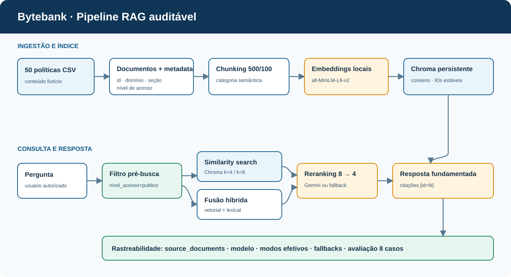
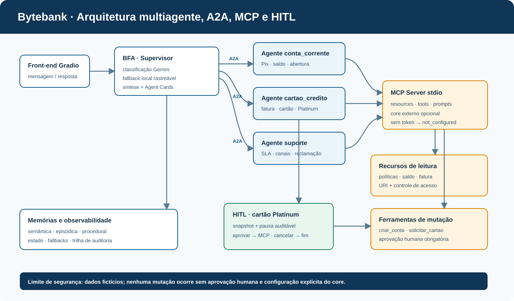

# Bytebank AI Ecosystem · Nível 2

Portfólio técnico do checkpoint Especialista em IA Nível 2: governança de IA, arquitetura e pipeline RAG auditável, avaliação comparativa e solução multiagente com A2A, MCP e Human-in-the-Loop.

> O Bytebank e todas as políticas deste repositório são fictícios. Não há dados reais de clientes nem integração financeira habilitada por padrão.

## Entregáveis

| # | Entregável | Evidência principal | Status |
|---|---|---|---|
| 1 | Governança e composição do time | [Documento](Docs/01-governanca.md), [CSV do time](data/composicao_time.csv), [carreira em Y](data/carreira_y.csv) e [planilha Google](https://docs.google.com/spreadsheets/d/1jJYN5SKQHZzNuuFBLDupMnQATMTfR3QBgl82MX-CJiE/edit?usp=sharing) | Concluído |
| 2 | Arquitetura RAG e glossário | [ADR RAG](Docs/02-arquitetura-rag.md), [diagrama editável](diagrams/rag.mmd), [SVG exportado](diagrams/rag.svg) e [glossário](data/glossario_rag.csv) | Concluído |
| 3 | Pipeline RAG funcional | [Código](src/rag_pipeline.py), [50 políticas](data/politicas_bytebank.csv), [avaliação](outputs/avaliacao_rag.csv) e [testes](tests/test_rag_pipeline.py) | Concluído |
| 4 | Arquitetura multiagente e portfólio | [Documento](Docs/04-arquitetura-multiagente.md), [SVG](diagrams/multiagente.svg), [grafo](src/multiagent_graph.py) e [servidor MCP](scripts/bytebank_mcp_server.py) | Concluído |

## Arquitetura RAG



O pipeline ingere 50 políticas com metadados, divide em chunks 500/100, gera embeddings locais com `all-MiniLM-L6-v2` e persiste no ChromaDB. A autorização filtra `nivel_acesso` antes da busca. A recuperação combina similaridade vetorial e ranking lexical; oito candidatos seguem para reranking e quatro para a resposta fundamentada.

## Arquitetura multiagente



O supervisor usa classificação estruturada Gemini e fallback local rastreável. A2A representa o contrato entre supervisor e agentes; MCP padroniza recursos, ferramentas e prompts. Solicitações Platinum e qualquer ferramenta de mutação exigem aprovação humana explícita.

## Resultado da avaliação

Rodada de 8 casos em 22/08/2026, com Chroma e `gemini-3.5-flash-lite`:

- sem RAG: **1/8 (12,5%)**;
- com RAG: **8/8 (100%)**;
- recuperação Chroma + híbrida: **8/8 casos**;
- três casos concluíram todas as etapas Gemini; nos demais, a cota HTTP 429 ativou fallback local registrado.

O [CSV de avaliação](outputs/avaliacao_rag.csv) informa, por caso, fontes, modo de recuperação, reranking, geração, juiz e fallbacks. Assim, um resultado parcial nunca é apresentado como se fosse uma execução integral do Gemini.

## Tecnologias

Python 3.11+, LangChain Text Splitters, Sentence Transformers, ChromaDB, LangGraph, Google Gen AI SDK, Pydantic, FastMCP, Gradio e unittest. Diagramas em Mermaid e SVG; documentação em Markdown e DOCX.

## Execução local

```powershell
python -m venv .venv
.\.venv\Scripts\Activate.ps1
python scripts/setup_runtime.py

# Pipeline vetorial local
python -m src.rag_pipeline --mode local --retrieval chroma

# Avaliação offline ou Gemini
python -m src.evaluation --mode local --retrieval chroma
python -m src.evaluation --mode gemini --retrieval chroma

# Grafo e conformidade
python -m src.multiagent_graph --mode auto
python -m unittest discover -s tests -v
python scripts/validate_project.py
```

Para Gemini, copie `.env.example` para `.env`, grave a chave apenas em `GOOGLE_API_KEY` e mantenha `.env` fora do Git. O modelo de embeddings funciona offline depois da preparação inicial.

## MCP

O servidor stdio inicia com:

```powershell
.\scripts\start_bytebank_mcp.ps1
```

Sem `BYTEBANK_CORE_API_BASE_URL` e `BYTEBANK_CORE_API_TOKEN`, leituras externas retornam `not_configured`. `criar_conta` e `solicitar_cartao` retornam `human_approval_required` enquanto `aprovado_por_humano` não for verdadeiro. Consulte [integrações MCP](Docs/06-integracoes-mcp.md).

## Estrutura

- [`data/`](data/): políticas, time, carreira, glossário e Agent Cards.
- [`diagrams/`](diagrams/): fontes Mermaid e exportações SVG.
- [`Docs/`](Docs/): governança, arquitetura, avaliações, análises, revisões e relatórios.
- [`src/`](src/): pipeline RAG, avaliação, integração Gemini, grafo e interface.
- [`scripts/`](scripts/): setup, MCP, validação e geração dos DOCX.
- [`tests/`](tests/): contratos de RAG, segurança, multiagente e MCP.

## Portfólio

### Motivação

Atendimento bancário precisa ser preciso, rastreável e seguro. O objetivo foi transformar políticas dispersas em respostas citadas e encaminhar cada intenção ao agente certo, sem misturar consulta com ação financeira.

### Principais decisões

- RAG em vez de fine-tuning para fatos mutáveis e remoção controlada de fontes.
- Chroma persistente com IDs estáveis e embeddings locais para reprodutibilidade.
- Filtro de acesso antes do retriever para impedir vazamento de contexto interno.
- Fusão vetorial + lexical para compensar limitações do modelo compacto em português.
- Fallbacks explícitos para não mascarar indisponibilidade ou cota do Gemini.
- HITL obrigatório antes de mutações sensíveis no MCP.

### Aprendizados

A arquitetura só é confiável quando avaliação, controle de acesso e trilha de execução fazem parte do fluxo. Protocolos ajudam a separar responsabilidades: A2A organiza colaboração entre agentes; MCP define como agentes acessam capacidades; HITL mantém responsabilidade humana em decisões sensíveis.

## Publicação e relatórios

- [GitHub Pages](https://fredjml.github.io/aluraCarreiraEspecialistaIANivel2B/)
- [Planilha Google — Governança e RAG](https://docs.google.com/spreadsheets/d/1jJYN5SKQHZzNuuFBLDupMnQATMTfR3QBgl82MX-CJiE/edit?usp=sharing)
- Relatório de levantamento: [Markdown](Docs/relatorio_levantamento_bytebank.md) · [DOCX](Docs/relatorio_levantamento_bytebank.docx)
- Relatório de implementação: [Markdown](Docs/relatorio_implementacao_bytebank.md) · [DOCX](Docs/relatorio_implementacao_bytebank.docx)
- [PR #1 integrado à `main`](https://github.com/fredjml/aluraCarreiraEspecialistaIANivel2B/pull/1)
- [Publicação do GitHub Pages concluída](https://github.com/fredjml/aluraCarreiraEspecialistaIANivel2B/actions/runs/32612667137)

Situação da entrega: os quatro entregáveis foram integrados à `main` pelo PR #1, e o portfólio foi publicado no GitHub Pages. Limites conhecidos: o dataset é fictício; o core bancário não foi fornecido; a rodada Gemini encontrou cota 429 e registrou os fallbacks.
