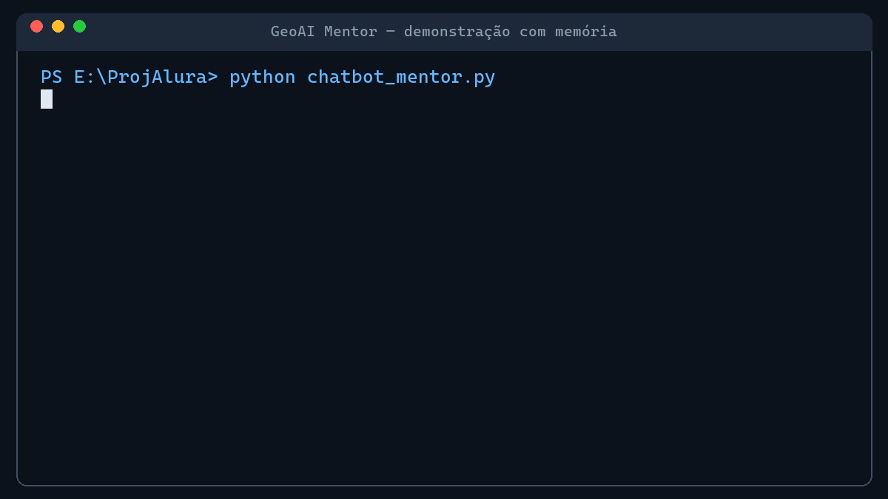

# Relatório Executivo Consolidado — GeoAI Mentor

Síntese não técnica da implementação, dos resultados e das evidências do projeto **GeoAI Mentor**.



| Campo | Informação |
|---|---|
| Público | Gestores, patrocinadores e usuários não técnicos |
| Finalidade | Apresentar o que foi entregue, como foi validado e o que falta para evolução |
| Período | Implementação e validação concluídas em 16/08/2026 |
| Situação | Protótipo funcional aprovado para demonstração controlada |

> **Conclusão principal:** o GeoAI Mentor foi implementado e testado com sucesso. Ele conversa com o modelo da OpenAI, assume uma personalidade voltada a geocientistas e preserva o contexto entre perguntas da mesma sessão.

## 1. Visão executiva

O projeto transformou uma ideia de assistente especializado em um protótipo executável. O usuário faz perguntas sobre transição de carreira e projetos de dados; o mentor responde de maneira amigável, didática e contextualizada para geociências.

A implementação foi construída em etapas controladas: preparação do ambiente, configuração segura do acesso, conexão com a inteligência artificial, definição da personalidade, inclusão de memória e revisão final. Cada etapa foi documentada e verificada antes do avanço.

## 2. Resultado em números

| Indicador | Resultado | Leitura simples |
|---|---|---|
| Etapas concluídas | 6 de 6 | Todo o escopo solicitado foi implementado e revisado. |
| Critérios finais | 9 de 9 aprovados | Nenhuma não conformidade foi encontrada na revisão final. |
| Perguntas do teste | 2 de 2 respondidas | O modelo respondeu e manteve o contexto da conversa. |
| Compilação | Aprovada | O programa passou pela verificação de integridade sem erros. |
| Proteção da chave | Aprovada | A credencial ficou fora do código e não foi exposta nos registros. |

## 3. O que foi entregue

- Um programa Python chamado `chatbot_mentor.py`, que inicia e executa o GeoAI Mentor.
- Uma interface web amigável em `streamlit_app.py`, com campo de conversa e botão para iniciar uma nova sessão.
- Conexão funcional com o modelo `gpt-5.6-sol` da OpenAI.
- Uma personalidade especializada em apoiar geocientistas na migração para Ciência de Dados.
- Memória por sessão, permitindo que uma pergunta posterior aproveite a resposta anterior.
- Persistência SQLite transacional, mantendo o histórico fora do processo Python.
- Gerenciamento de conversas para criar, listar, reabrir, renomear e excluir históricos.
- Piloto RAG local com fontes Markdown aprovadas, citações de origem e recusa sem evidência.
- Separação entre conversas, evitando mistura de históricos com identificadores diferentes.
- Configuração segura da chave de acesso por arquivo `.env`, ignorado pelo controle de versão.
- Documentação inicial e registro técnico passo a passo no diretório `Analise`.

### Como abrir a interface

No PowerShell, com o ambiente virtual ativo, execute:

```powershell
pip install -r requirements.txt
streamlit run streamlit_app.py
```

O navegador abrirá o GeoAI Mentor. Digite uma pergunta no campo inferior. O `st.session_state` conserva apenas o estado visual; o histórico oficial é gravado no SQLite. A barra lateral permite iniciar, listar, reabrir, renomear e excluir conversas.

Para executar a versão de terminal, use `python chatbot_mentor.py`.

### Operação local

Os limites operacionais são configurados por `OPENAI_REQUEST_TIMEOUT`, `OPENAI_MAX_OUTPUT_TOKENS` e `GEOAI_RETENTION_DAYS`. Para inspecionar o banco, criar um backup consistente ou aplicar a retenção:

```powershell
python scripts/operacoes_geoai.py status
python scripts/operacoes_geoai.py backup
python scripts/operacoes_geoai.py retencao --dias 90
```

Os backups são gravados em `backups/`, fora do Git. A retenção exclui conversas cuja última atualização seja anterior ao período informado.

### Arquitetura separada

O projeto utiliza camadas com responsabilidades distintas:

```text
Interface Streamlit / CLI
          ↓
MentorService (casos de uso)
          ↓
MentorGateway (contrato do domínio)
          ↓
LangChain + OpenAI
          ↓
ConversationRepository → SQLite
```

O front-end não importa LangChain ou `ChatOpenAI`. Ele conhece somente o `MentorService`, que pode receber um back-end falso nos testes. A configuração do modelo está centralizada em `geoai_mentor/config/settings.py`, e os erros técnicos são convertidos em mensagens seguras antes de chegar ao usuário.

## 4. Como a experiência funciona

1. O usuário inicia o programa e faz uma pergunta ao GeoAI Mentor.
2. O programa combina a pergunta com a orientação de personalidade e, quando existente, com o histórico da sessão.
3. A solicitação é enviada ao modelo de inteligência artificial.
4. A pergunta e a resposta são gravadas atomicamente no banco SQLite.
5. Na pergunta seguinte, o histórico é reutilizado para manter continuidade e evitar repetições.

> **Exemplo observado:** depois de recomendar Python, o mentor entendeu que a expressão _“essa linguagem”_ na segunda pergunta se referia a Python e sugeriu projetos coerentes com essa recomendação.

## 5. Benefícios demonstrados

| Benefício | Efeito para o usuário |
|---|---|
| Orientação especializada | Respostas com foco em geociências, carreira e Ciência de Dados. |
| Continuidade da conversa | O usuário pode fazer perguntas complementares sem repetir todo o contexto. |
| Experiência didática | Linguagem amigável e recomendações práticas para quem está aprendendo. |
| Base modular | O armazenamento possui contrato próprio e pode evoluir de SQLite para PostgreSQL. |
| Rastreabilidade | Etapas, decisões, testes e resultados estão registrados para auditoria e consolidação. |

## 6. Testes e evidências de funcionamento

Os testes demonstraram não apenas que o código existe, mas que o comportamento esperado ocorreu na prática.

| O que foi verificado | Situação | Evidência observada |
|---|---|---|
| Configuração segura | Aprovado | A chave foi localizada no `.env` sem ser exibida, copiada ou gravada no código. |
| Conexão com a OpenAI | Aprovado | O modelo recebeu as solicitações e devolveu conteúdo para as duas perguntas. |
| Personalidade do mentor | Aprovado | As respostas usaram orientação e exemplos relacionados a geociências e dados. |
| Memória da conversa | Aprovado | A segunda resposta interpretou corretamente _“essa linguagem”_ como Python. |
| Separação de sessões | Aprovado | O mesmo identificador reutilizou o histórico; outro identificador recebeu histórico independente. |
| Persistência | Aprovado | O histórico foi recuperado por outra instância do repositório e permaneceu isolado por conversa. |
| Atomicidade | Aprovado | Uma falha simulada na resposta desfez também a gravação da pergunta. |
| Cobertura | Aprovado | Limite reproduzível de 85%; componentes críticos de aplicação, configuração e domínio atingiram 100%. |
| Sessões completas | Aprovado | O ciclo criar, listar, reabrir, renomear e excluir foi validado. |
| RAG controlado | Aprovado | Fontes locais autorizadas são recuperadas e identificadas; consultas sem evidência recebem contexto explícito de recusa. |
| Integridade do programa | Aprovado | A compilação terminou sem erro e os 37 testes automatizados foram aprovados. |
| Interface web | Aprovado | O teste do Streamlit confirmou título, mensagem inicial, entrada de chat e reinício da conversa. |
| Consistência das chaves | Aprovado | `query` e `historico` são iguais no template e na configuração do componente de memória. |

## 7. Segurança e privacidade

A chave da OpenAI funciona como uma senha do serviço. Por isso, foi mantida em arquivo local separado e não foi incluída no código, na documentação ou nas saídas de teste. O `.gitignore` impede o envio acidental do `.env` ao repositório.

> **Orientação de segurança:** a chave não deve ser enviada por mensagem, capturada em tela ou incluída no Git. Se houver suspeita de exposição, ela deve ser revogada e substituída na plataforma da OpenAI.

## 8. Limitações atuais

- A interface web é local; ainda não foi publicada em um serviço de hospedagem.
- A base RAG é deliberadamente pequena e lexical; ainda não usa embeddings nem fontes institucionais externas.
- O conteúdo é gerado por inteligência artificial e deve ser tratado como orientação, não como decisão profissional automática.
- O uso da API pode gerar custos conforme o volume de solicitações e as regras da conta utilizada.
- A retenção é configurável e testada, mas sua política institucional e seus responsáveis ainda precisam ser aprovados.
- Autenticação, separação por usuário e hospedagem controlada dependem da infraestrutura escolhida.

## 9. Recomendações e próximos passos

| Prioridade | Recomendação | Resultado esperado |
|---|---|---|
| Alta | Definir política de retenção e proteção do banco. | Governança do histórico persistente. |
| Alta | Publicar a interface Streamlit em ambiente controlado. | Acesso por navegador sem instalação local. |
| Alta | Definir limites de custo, logs e alertas de consumo. | Operação previsível e acompanhamento financeiro. |
| Média | Adicionar uma base de conhecimento validada sobre geociências e carreira. | Respostas mais rastreáveis e alinhadas ao conteúdo institucional. |
| Média | Criar testes automatizados de comportamento e segurança. | Menor risco de regressão durante novas implementações. |
| Média | Realizar piloto com geocientistas e coletar feedback. | Validação de utilidade, clareza e adequação das recomendações. |
| Média | Substituir ou ampliar a base piloto somente com fontes institucionais revisadas. | RAG mais abrangente sem perder rastreabilidade. |

## 10. Conclusão executiva

O GeoAI Mentor atingiu o objetivo desta fase: demonstrar uma conversa especializada, conectada à OpenAI e capaz de manter contexto durante uma sessão. Os testes confirmaram o funcionamento, a consistência da configuração e a proteção da credencial.

O resultado deve ser entendido como um protótipo funcional com persistência local, gerenciamento de sessões e um piloto RAG controlado. A recomendação é definir governança do banco e das fontes, adicionar controles de custo e validar a utilidade com usuários antes de ampliar a base.

---

## Apêndice A — Evidência técnica

Esta seção preserva os elementos necessários para comprovar tecnicamente a implementação. Os registros completos permanecem no documento passo a passo; abaixo está a síntese auditável.

| Categoria | Comando ou verificação | Resultado |
|---|---|---|
| Ambiente | `.venv\Scripts\python.exe --version` | Python 3.12.13 executado no ambiente isolado. |
| Dependências | `pip install -r requirements.txt` | `python-dotenv`, `langchain` e `langchain-openai` instalados e importáveis. |
| Compilação | `.venv\Scripts\python.exe -m py_compile chatbot_mentor.py` | Conclusão sem erros. |
| Execução funcional | `.venv\Scripts\python.exe chatbot_mentor.py` | Duas respostas exibidas e processo encerrado com código zero. |
| Chave | Verificação estrutural do `.env` | Uma atribuição `OPENAI_API_KEY` encontrada; valor não exibido. |
| Singleton | Comparação de identidade do histórico | Mesma sessão retornou o mesmo objeto; sessão distinta retornou outro. |
| Memória | Duas perguntas com `session_id=sessao_demo` | A segunda resposta recuperou Python do contexto anterior. |

### A.1 Retorno da API e comportamento observado

Na pergunta inicial, o usuário informou ser geofísico, desejava migrar para dados e perguntou qual linguagem aprender primeiro. O modelo recomendou Python como linguagem principal.

Na pergunta seguinte, o usuário perguntou que projeto poderia criar usando _“essa linguagem”_. Com a memória ativa, o modelo associou a expressão a Python e sugeriu projetos relacionados, incluindo análise de dados sísmicos e outras aplicações de geociências.

> **Critério de aceite atendido:** a mudança entre o teste sem memória e o teste com memória demonstrou recuperação do contexto, pois deixou de ser necessário perguntar qual linguagem estava sendo mencionada.

## Apêndice B — Evidência executiva

A evidência executiva converte os achados técnicos em indicadores que permitem decisão sem exigir leitura de código.

| Dimensão | Indicador | Avaliação executiva |
|---|---|---|
| Entrega | 6/6 etapas concluídas | Escopo integral desta fase entregue. |
| Qualidade | 9/9 critérios finais aprovados | Nenhum erro comum identificado na revisão. |
| Funcionalidade | 2/2 perguntas respondidas | Conexão e geração de respostas comprovadas. |
| Contexto | Referência anterior recuperada | Memória conversacional comprovada na mesma sessão. |
| Segurança | Credencial não exposta | Tratamento básico da chave aprovado. |
| Prontidão | Protótipo funcional | Adequado para demonstração e evolução; ainda não é produção. |

## Apêndice C — Artefato reproduzível

Os arquivos e as instruções abaixo permitem repetir a validação em uma estação Windows com Python e uma chave válida da OpenAI.

### C.1 Arquivos necessários

| Arquivo | Finalidade |
|---|---|
| `geoai_mentor/application/` | Serviço de aplicação e casos de uso. |
| `geoai_mentor/domain/` | Contratos e erros independentes de frameworks. |
| `geoai_mentor/infrastructure/` | Integração com LangChain, OpenAI e repositório SQLite. |
| `geoai_mentor/interfaces/` | Implementações da interface web e do terminal. |
| `geoai_mentor/config/` | Configuração centralizada e validada. |
| `chatbot_mentor.py` | Ponto de entrada compatível do terminal. |
| `streamlit_app.py` | Ponto de entrada compatível do Streamlit. |
| `requirements.txt` | Lista das bibliotecas necessárias. |
| `requirements-dev.txt` | Dependências para executar os testes. |
| `tests/` | Testes automatizados de memória e interface. |
| `Analise/docsgeo/` | Dez fontes Markdown curadas e autorizadas para o piloto RAG local. |
| `.env` | Configuração local da `OPENAI_API_KEY`; não deve ser versionado. |
| `.env.example` | Modelo seguro do nome da variável, sem chave real. |
| `.gitignore` | Proteção contra inclusão acidental do `.env` e do ambiente virtual. |

### C.2 Como repetir os testes

1. Abra o PowerShell na pasta raiz do projeto.
2. Ative o ambiente virtual com `.venv\Scripts\Activate.ps1`.
3. Instale ou confirme as dependências com `pip install -r requirements.txt`.
4. Confirme que o `.env` contém `OPENAI_API_KEY` com uma chave válida, sem exibi-la no terminal.
5. Execute a compilação: `python -m py_compile chatbot_mentor.py`.
6. Execute os testes automatizados: `python -m pytest -q`.
7. Execute a interface: `streamlit run streamlit_app.py`.
8. Faça duas perguntas relacionadas e verifique se a segunda considera a linguagem recomendada na primeira.

### C.3 Critérios de aprovação

- A compilação termina sem mensagem de erro.
- A chave não aparece no console, no código nem no relatório.
- As duas respostas são apresentadas no terminal.
- A segunda resposta compreende a referência à linguagem indicada anteriormente.
- Uma nova sessão recebe histórico separado da sessão de demonstração.
- A execução falha automaticamente se a cobertura total ficar abaixo de 85%.

## Rastreabilidade

Os detalhes, decisões, correções e evidências de cada etapa estão em:

- `Analise/RegistroPassoAPasso_Implementacao_GeoAI_Mentor.docx`;
- `Analise/RelatorioExecutivoConsolidado_GeoAI_Mentor.docx`.
